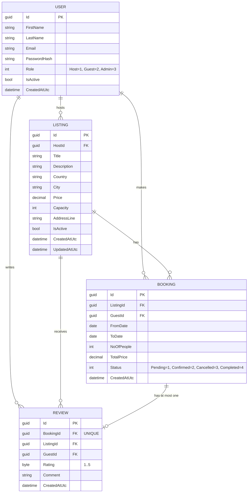

# SE4458 Midterm - AirbnbClone

## Student Information

- Full Name: Emre Akar
- Student Number: 21070006213

## Project Video Presentation
- **▶️ [Watch the Project Presentation Video on Google Drive](https://drive.google.com/file/d/1TC427OCnVqQ3avdEzmFnZEPdtLh7pcyn/view?usp=sharing)**

---

# AirbnbClone Load Testing Report (k6)

## Gateway Deployment Information

- Gateway Web App: https://emre-gateway-vize.azurewebsites.net
- Downstream API: https://se4448-midterm-c2dnamecffbhehfd.swedencentral-01.azurewebsites.net
- Gateway rate limit policy: Daily limit of 3 requests for guest listing queries (Ocelot)
- The instructor can directly click this link to verify: https://emre-gateway-vize.azurewebsites.net/api/listings (no extra X-Client-Id header required)
- If X-Client-Id is not provided, the Gateway automatically assigns a default identity using client IP information, so rate limiting remains active in browser-based access.

## Tested Endpoints

1. `GET /api/listings`
2. `POST /api/bookings`

Reason these two endpoints were selected:
- `GET /api/listings` is one of the most frequently called read endpoints and reflects overall query performance.
- `POST /api/bookings` includes business logic, date overlap checks, and database write steps; it is critical for observing transactional capacity under load.

## Scenarios

- Normal: 20 VU, 30 seconds
- Peak: 50 VU, 30 seconds
- Stress: 100 VU, 30 seconds

Note: `load-test.js` runs the scenarios sequentially (total 90 seconds).

## Running the Test

1. Verify k6 installation:
   - `k6 version`
2. Set the target URL based on Gateway or direct API usage (default: Gateway URL).
3. Run the test:
   - `k6 run load-test.js`
4. Optionally override token/URL:
   - `k6 run -e BASE_URL=https://emre-gateway-vize.azurewebsites.net -e JWT_TOKEN=<TOKEN> load-test.js`

Test output is saved in `k6-results.txt`.

## Result Table

| Scenario | VU | Duration | Average response time (ms) | p95 (ms) | Req/sec | Error Rate |
|---|---:|---:|---:|---:|---:|---:|
| Normal | 20 | 30s | 237.95 | 1100.00 | 25.97 | 50.00% |
| Peak | 50 | 30s | 251.26 | 1110.00 | 61.09 | 50.00% |
| Stress | 100 | 30s | 608.70 | 2080.00 | 81.80 | 50.00% |

## Short Analysis

In this test design, frequent 429 (Too Many Requests) and 401 (Unauthorized) responses are expected outcomes because the goal is to validate Gateway throttling and auth protection under load. The daily 3-request limit for guest listing queries is intentionally triggered and the Gateway blocks out-of-policy traffic as designed. Therefore, status distribution should be interpreted together with policy behavior, not as a raw success/failure metric. In future iterations, adding Redis distributed caching could further optimize load handling at the gateway layer.

## k6 Result Analysis 

In the latest Gateway-based test run, average response time was 237.95 ms at 20 VU, 251.26 ms at 50 VU, and 608.70 ms at 100 VU. p95 latency was measured as 1100.00 ms, 1110.00 ms, and 2080.00 ms respectively, showing visible latency growth under stress load. Throughput increased from 25.97 req/sec (Normal) to 61.09 req/sec (Peak) and 81.80 req/sec (Stress). The 50.00% check failure rate is expected in this setup because booking checks intentionally encounter protected/auth-limited responses while Gateway throttling policies are being validated.

## Design Decisions

- No direct database access was done in the controller layer; all business rules were kept in the service layer.
- Centralized routing and rate limiting were implemented in the gateway layer using Ocelot.
- Swagger was kept enabled in production to simplify operational testing and observability.
- Azure App Service startup command was configured to run the DLL directly for consistent host startup behavior.

## Database Model (ER Diagram)

