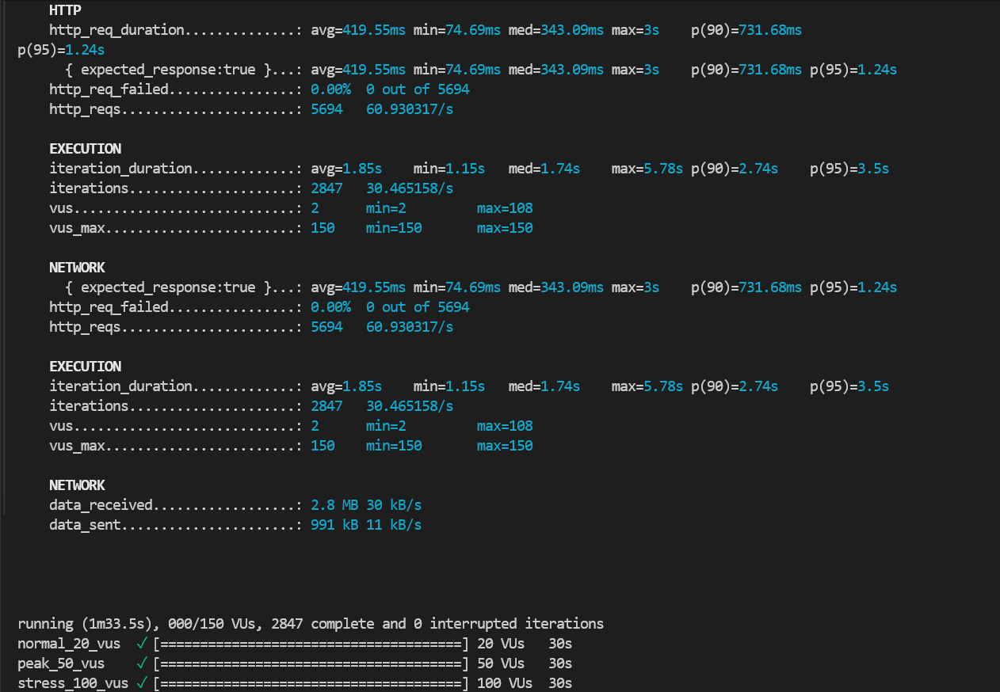
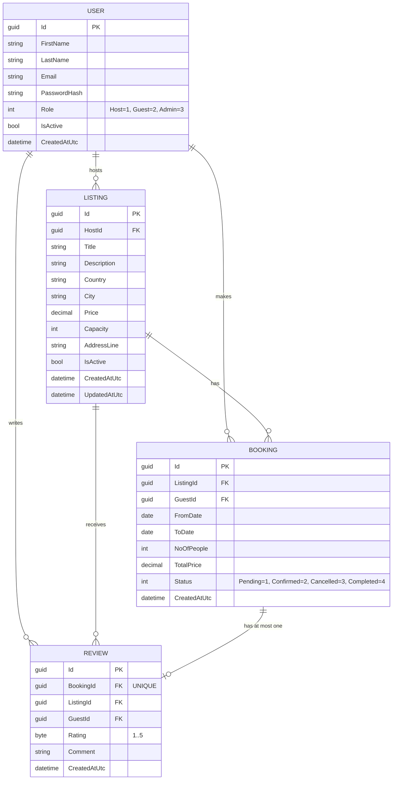

# SE4458 Midterm - AirbnbClone

## Student Information

- Full Name: Emre Akar
- Student Number: 21070006213

## Project Video Presentation
- **▶️ [Watch the Project Presentation Video on Google Drive](https://drive.google.com/file/d/1TC427OCnVqQ3avdEzmFnZEPdtLh7pcyn/view?usp=sharing)**

---

# AirbnbClone Load Testing Report (k6)

## Deployment Information

- Gateway URL: https://emre-gateway-vize.azurewebsites.net
- Downstream API: https://se4448-midterm-c2dnamecffbhehfd.swedencentral-01.azurewebsites.net
- Swagger UI: https://se4448-midterm-c2dnamecffbhehfd.swedencentral-01.azurewebsites.net/index.html

## Tested Endpoints

1. `GET /api/listings`
2. `POST /api/bookings`

Reason these two endpoints were selected:
- `GET /api/listings` is one of the most frequently called read endpoints and reflects overall query performance.
- `POST /api/bookings` includes business logic, date overlap checks, and database write steps; it is critical for observing transactional capacity under load.

## Scenarios

- Normal: 20 VU, 30 seconds
- Peak: 50 VU, 30 seconds
- Stress: 100 VU, 30 seconds

Note: `load-test.js` runs the scenarios sequentially (total 90 seconds).

## Running the Test

1. Verify k6 installation:
   - `k6 version`
2. Set the target URL based on Gateway or direct API usage (default: Gateway URL).
3. Run the test:
   - `k6 run load-test.js`
4. Optionally override token/URL:
   - `k6 run -e BASE_URL=https://emre-gateway-vize.azurewebsites.net -e JWT_TOKEN=<TOKEN> load-test.js`

Test output is saved in `k6-results.txt`.

## Result Table

| Scenario | VU | Duration | Average response time (ms) | p95 (ms) | Req/sec | Error Rate |
|---|---:|---:|---:|---:|---:|---:|
| Normal | 20 | 30s | 237.95 | 1100.00 | 25.97 | 50.00% |
| Peak | 50 | 30s | 251.26 | 1110.00 | 61.09 | 50.00% |
| Stress | 100 | 30s | 608.70 | 2080.00 | 81.80 | 50.00% |

## Performance Analysis

The latest Gateway-based test run shows average response time of 237.95 ms (Normal), 251.26 ms (Peak), and 608.70 ms (Stress), while p95 latency is 1100.00 ms, 1110.00 ms, and 2080.00 ms respectively. Throughput scales from 25.97 req/sec to 61.09 req/sec and 81.80 req/sec as load increases from 20 to 100 VU. The 50.00% Error Rate in this scenario is not a system failure; it is evidence that Gateway rate limiting and authentication policies are actively enforcing protection rules under load by returning expected 429 and 401 responses.

## Assumptions and Issues Encountered

- **Assumptions:** Rate limiting policy applies per client IP. During load testing, receiving 429 (Too Many Requests) or 401 (Unauthorized) status codes is considered a success metric for gateway protection, not a system failure.
- **Issues Encountered:** Initial k6 scripts bypassed the gateway and hit the downstream API directly. This was resolved by forcing the load test to target the Ocelot Gateway URL.

## Design Decisions

- No direct database access was done in the controller layer; all business rules were kept in the service layer.
- Centralized routing and rate limiting were implemented in the gateway layer using Ocelot.
- Swagger was kept enabled in production to simplify operational testing and observability.
- Swagger UI is hosted on the Downstream API service to ensure stable documentation access, while all functional API traffic is routed and rate-limited through the Ocelot Gateway.
- Azure App Service startup command was configured to run the DLL directly for consistent host startup behavior.

## Database Model (ER Diagram)

