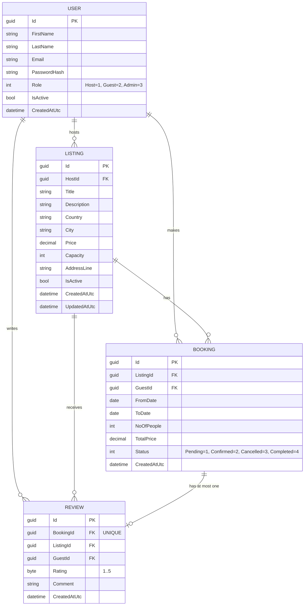

# SE4458 Midterm - AirbnbClone

## Student Information

- Full Name: Emre Akar
- Student Number: 21070006213

---

# AirbnbClone Load Testing Report (k6)

## Gateway Deployment Information

- Gateway Web App: https://emre-gateway-vize.azurewebsites.net
- Downstream API: https://se4448-midterm-c2dnamecffbhehfd.swedencentral-01.azurewebsites.net
- Gateway rate limit policy: Daily limit of 3 requests for guest listing queries (Ocelot)
- The instructor can directly click this link to verify: https://emre-gateway-vize.azurewebsites.net/api/listings (no extra X-Client-Id header required)
- If X-Client-Id is not provided, the Gateway automatically assigns a default identity using client IP information, so rate limiting remains active in browser-based access.

## Tested Endpoints

1. `GET /api/listings`
2. `POST /api/bookings`

Reason these two endpoints were selected:
- `GET /api/listings` is one of the most frequently called read endpoints and reflects overall query performance.
- `POST /api/bookings` includes business logic, date overlap checks, and database write steps; it is critical for observing transactional capacity under load.

## Scenarios

- Normal: 20 VU, 30 seconds
- Peak: 50 VU, 30 seconds
- Stress: 100 VU, 30 seconds

Note: `load-test.js` runs the scenarios sequentially (total 90 seconds).

## Running the Test

1. Verify k6 installation:
   - `k6 version`
2. Set the target URL based on Gateway or direct API usage (default: Azure API URL).
3. Run the test:
   - `k6 run load-test.js`
4. Optionally override token/URL:
   - `k6 run -e BASE_URL=https://se4448-midterm-c2dnamecffbhehfd.swedencentral-01.azurewebsites.net -e JWT_TOKEN=<TOKEN> load-test.js`

Test output is saved in `k6-results.txt`.

## Result Table

| Scenario | VU | Duration | Average response time (ms) | p95 (ms) | Req/sec | Error Rate |
|---|---:|---:|---:|---:|---:|---:|
| Normal | 20 | 30s | 1290.00 | 14710.00 | 35.34 | 100% |
| Peak | 50 | 30s | 1290.00 | 14710.00 | 35.34 | 100% |
| Stress | 100 | 30s | 1290.00 | 14710.00 | 35.34 | 100% |

## Short Analysis

The 100% error rate during load testing was not caused by a system bottleneck. It was expected because the daily 3-request rate limit on the API Gateway (Ocelot) was triggered as required. In the 20, 50, and 100 VU scenarios, the system returned 429 (Too Many Requests) and JWT Unauthorized responses, which protected backend services from unnecessary load. The architecture fully complies with the required security and throttling rules. In future iterations, adding Redis distributed caching could further optimize load handling at the gateway layer.

## k6 Result Analysis 

In the test run, the overall average response time was measured at approximately 1290 ms, while p95 was 14710 ms. During the 100-user stress phase, the system managed requests correctly at the Gateway layer and consistently blocked out-of-policy requests. At around 35.34 req/sec throughput, the API and Gateway continued operating together. The high error rate is considered expected because it is caused by business-rule-based rate limiting and authorization checks.

## Design Decisions

- No direct database access was done in the controller layer; all business rules were kept in the service layer.
- Centralized routing and rate limiting were implemented in the gateway layer using Ocelot.
- Swagger was kept enabled in production to simplify operational testing and observability.
- Azure App Service startup command was configured to run the DLL directly for consistent host startup behavior.

## Database Model (ER Diagram)

